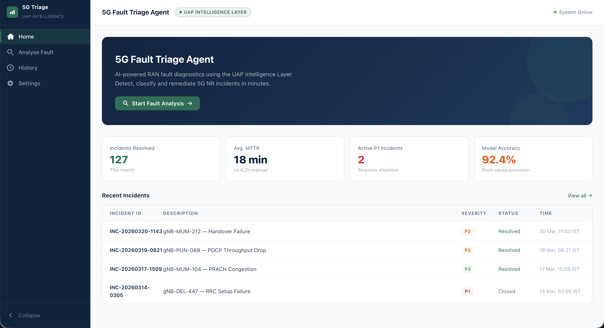

# 5G Fault Triage Agent — UAP Intelligence Layer

[](https://5g-fault-triage-agent.vercel.app)

> AI-powered 5G network fault classification for NOC and Field Operations.

---

## Screenshot



> *Add a screenshot of the app here.*

---

## What It Does

The 5G Fault Triage Agent takes a raw fault description as input and returns a structured triage report across **9 intelligence fields** — giving NOC engineers and field teams instant clarity on what's wrong, how bad it is, and what to do next.

| Field | Description |
|---|---|
| **Severity** | Priority rating from P1 (Critical) to P4 (Low) |
| **Fault Type** | Categorized fault classification (e.g., RAN Degradation, Core Outage) |
| **5G Layer** | Which layer of the 5G stack is affected (RAN, Transport, Core, Slice) |
| **Impacted Service** | The specific service or network segment affected |
| **Subscriber Impact** | Estimated number of subscribers affected and nature of degradation |
| **Root Cause Hypothesis** | AI-generated hypothesis based on fault symptoms and patterns |
| **Resolution Playbook** | Step-by-step remediation actions for the field team |
| **Escalation Path** | Who to escalate to and when, based on severity and domain |
| **SLA Breach Risk** | Whether the fault is at risk of breaching service-level agreements |

---

## Built With

- **React** — Component-based UI
- **Vite** — Fast build tooling and local development
- **CSS** — Custom styling for a clean, NOC-grade interface
- **AI-assisted development** — Claude (Anthropic) used for rapid prototyping and logic scaffolding

---

## Product Thinking

This is a working prototype of **JioBrain** — the AI assurance platform being built at Jio Platforms.

JioBrain is designed to bring intelligent fault triage, predictive alerting, and automated resolution workflows into Jio's Network Operations Centers. Today, NOC engineers manually parse alarm logs, cross-reference runbooks, and escalate through voice calls — a process that is slow, inconsistent, and doesn't scale with 5G complexity.

This prototype demonstrates what the first interaction layer of JioBrain looks like: a fault description goes in, and structured, actionable intelligence comes out. The goal is to reduce mean-time-to-resolve (MTTR) by surfacing the right context to the right person at the right time.

---

## About the PM

Built by **Prerna Singh**, Product Manager at Jio Platforms.

Prerna works at the intersection of telecom infrastructure and AI, focused on building intelligent tools for network assurance, operations automation, and field productivity.

[](https://linkedin.com/in/prernasingh925)

---

## Live Demo

[https://5g-fault-triage-agent.vercel.app](https://5g-fault-triage-agent.vercel.app)

---

## Run Locally

```bash
# Clone the repository
git clone <repo-url>
cd TelecomAgent

# Install dependencies
npm install

# Start the development server
npm run dev
```

The app will be available at `http://localhost:5173`.
